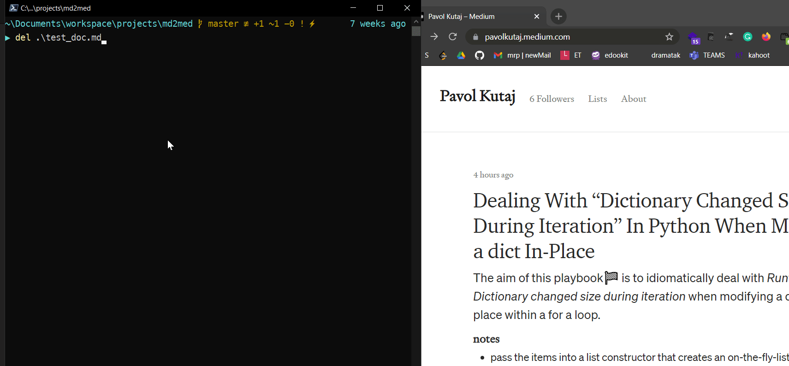
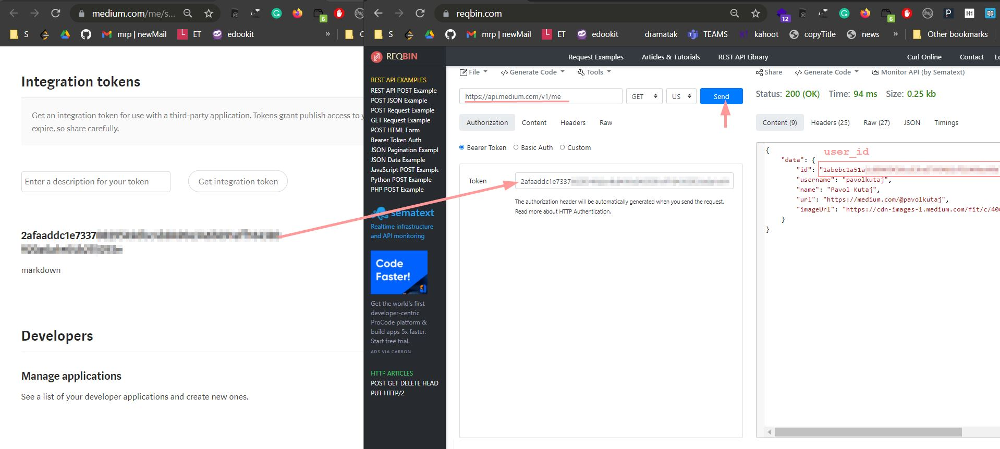

# md2med
[](https://forthebadge.com)


The aim of this code🎯 is to send a markdown file into Medium. Please note currently this is **text-only**. The following demo creates `test_doc.md` with _hello there_ text and sends it to medium with the script.  



### 1. environmental variables
* you need the following 3 envirnomental variables

| Name            | Comment                                |
|-----------------|----------------------------------------|
| `md2med_TOKEN`  | integration token from medium settings |
| `md2med_USERID` | user id obtained via API call          |
| `md2med_SCRIPT` | path to `md2med.py`                    |
| `cacert`        | path to `cacert.pem`                   |

### 2. instructions
* open https://medium.com/me/settings -> Integration tokens -> Get **integration token**
* create an enviroment variable `md2med_TOKEN` with the value obtained in the step above
* open [API Testing Tool](https://reqbin.com/) and populate as follows:
    - insert `https://api.medium.com/v1/me` into the address bar
    - insert **integration token** into _Token_ field, leave the default selection _Bearer Token_ 
    - press _Send_ -> obtain the value from _id_ key from the response
* create an environment variable `md2med_USERID` with the value of _id_ obtained in the step above


 
* download `cacert.pem` from [curl - Extract CA Certs from Mozilla](https://curl.se/docs/caextract.html) 
* create an environment variable `cacert` with the value of the path pointing to the cert file
* now you are ready to run the script 
* navigate to the folder where you have your markdown file you want to publish
* call `md2med.py` ideally via environmental variable so that don't have to copy it to the folder with markdown file with the following parameters:
    - `--doc_name` -> random title
    - `--file_to_publish` -> file name
    - `--tag` ->

```powershell
# no environmental vars
python .\md2med.py --doc_name "hello there!" --file_to_publish "./test_doc.md" --tag "python"
# with environmental var in PowerShell
python $env:md2med_SCRIPT --doc_name "hello there!" --file_to_publish "./test_doc.md" --tag "python"
```